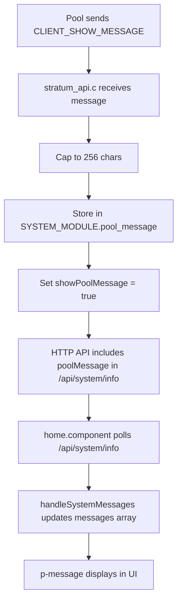

# Implementation Plan: Pool Message Capping and Frontend Exposure

## Current Situation

In [`stratum_api.c`](components/stratum/stratum_api.c:407), line 407-413, the `CLIENT_SHOW_MESSAGE` handler currently prints pool messages directly to the ESP log without any length capping:

```c
} else if (message->method == CLIENT_SHOW_MESSAGE) {
    cJSON * params = cJSON_GetObjectItem(json, "params");
    if (params && cJSON_IsArray(params) && cJSON_GetArraySize(params) > 0) {
        cJSON * msg_item = cJSON_GetArrayItem(params, 0);
        if (msg_item && cJSON_IsString(msg_item)) {
            ESP_LOGI(TAG, "Pool message: %s", msg_item->valuestring);
        }
    }
}
```

## Issues

1. **No length capping**: Pool messages can be arbitrarily long, which could cause issues on memory-constrained ESP32
2. **Not exposed to frontend**: Users cannot see pool messages in the AxeOS interface

## Frontend Integration Design

The user wants to integrate pool messages into the existing message display system in [`home.component.ts`](main/http_server/axe-os/src/app/components/home/home.component.ts:631), which uses:
- A `messages` array with `ISystemMessage` objects containing `type`, `severity`, and `text`
- An `updateMessage()` function that adds/removes messages based on conditions
- Block found uses a separate dismissible component at [`home.component.html:18`](main/http_server/axe-os/src/app/components/home/home.component.html:18)
- The pattern for dismissing notifications follows [`POST_dismiss_block_found`](main/http_server/http_server.c:760)

## Implementation Steps

### Phase 1: Backend Changes

1. **Add pool message field to GlobalState** ([`global_state.h`](main/global_state.h))
   - Add `char pool_message[257]` to `SystemModule` struct (256 chars + null terminator)
   - This allows storing the capped message

2. **Cap message length in stratum_api.c** ([`stratum_api.c`](components/stratum/stratum_api.c:411))
   - Add a `#define MAX_POOL_MESSAGE_LEN 256` constant
   - Cap the message string to this length when logging

3. **Handle CLIENT_SHOW_MESSAGE in stratum_task.c** ([`stratum_task.c`](main/tasks/stratum_task.c))
   - Add handling for `CLIENT_SHOW_MESSAGE` method
   - Store the capped message in `GLOBAL_STATE->SYSTEM_MODULE.pool_message`

4. **Add poolMessage to /api/system/info endpoint** ([`http_server.c`](main/http_server/http_server.c))
   - Add `poolMessage` field to the JSON response in `GET_system_info`
   - Include a `showPoolMessage` boolean to indicate if a message should be displayed

5. **Add dismiss endpoint** (optional, similar to block found)
   - Add `POST_dismiss_pool_message` handler
   - Clear `pool_message` and reset `showPoolMessage`

### Phase 2: Frontend Changes

6. **Update ISystemInfo interface** (generated from OpenAPI)
   - Add `poolMessage?: string` field
   - Add `showPoolMessage?: boolean` field

7. **Update home.component.ts** ([`home.component.ts`](main/http_server/axe-os/src/app/components/home/home.component.ts:631))
   - Add pool message handling in `handleSystemMessages()`:
   ```typescript
   updateMessage(!!info.showPoolMessage, 'POOL_MESSAGE', 'info', info.poolMessage || '');
   ```

8. **Add dismiss functionality** (optional)
   - Add `dismissPoolMessage()` method in home.component.ts
   - Call the backend dismiss endpoint

## Data Flow



## Files to Modify

### ESP32 (C)
- [`components/stratum/stratum_api.c`](components/stratum/stratum_api.c) - Add length capping
- [`components/stratum/include/stratum_api.h`](components/stratum/include/stratum_api.h) - Add constant
- [`main/global_state.h`](main/global_state.h) - Add pool_message field
- [`main/tasks/stratum_task.c`](main/tasks/stratum_task.c) - Handle CLIENT_SHOW_MESSAGE
- [`main/http_server/http_server.c`](main/http_server/http_server.c) - Add to API response

### Angular Frontend
- Generated API models (auto-generated from OpenAPI)
- [`main/http_server/axe-os/src/app/components/home/home.component.ts`](main/http_server/axe-os/src/app/components/home/home.component.ts)
- [`main/http_server/axe-os/src/app/services/system.service.ts`](main/http_server/axe-os/src/app/services/system.service.ts)

## Notes

- The 256 character limit matches the buffer size in GlobalState
- Pool messages use severity 'info' (blue) to differentiate from warnings/errors
- The message is displayed using the existing `p-message` component from PrimeNG
- Polling happens through the existing system info refresh cycle
